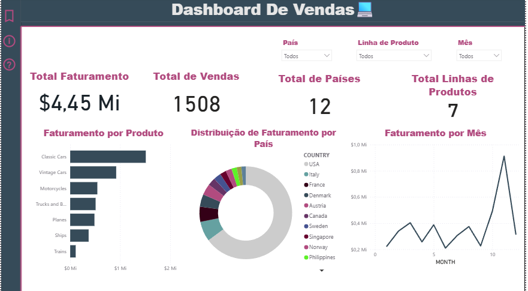

# 📊 Projeto de Análise de Dados: Vendas Integradas (Python + SQL + Power BI)

Este projeto demonstra um fluxo de dados prático, onde utilizei **Python** para o tratamento de dados brutos e o **DBeaver** como interface principal para gestão de banco de dados e execução de consultas analíticas. O resultado final é um Dashboard estratégico no **Power BI**.

## 📝 Descrição do Projeto
O objetivo foi transformar dados brutos de vendas em informações organizadas. O foco foi garantir que a limpeza feita no Python resultasse em tabelas prontas para consultas SQL complexas, servindo de base para a visualização de indicadores de desempenho.

## 🛠️ Tecnologias e Ferramentas
* **Linguagem:** Python 3.x (Biblioteca Pandas)
* **Gestão de Banco de Dados:** DBeaver (Interface para SQL), usei o SQL Lite.
* **Visualização de Dados:** Power BI

## 🔄 Fluxo de Trabalho

### 1. Tratamento e Limpeza (Python/Pandas)
Antes de levar para o banco de dados, utilizei o Pandas para preparar os dados:
* Remoção de duplicatas e tratamento de valores nulos.
* Padronização de colunas para facilitar a importação no SQL.
* Garantia da integridade dos tipos de dados (datas, números e textos).

### 2. Banco de Dados e Consultas (SQL/DBeaver)
Utilizei o DBeaver para gerenciar o banco de dados e realizar a carga dos dados tratados:
* **Importação:** Carga dos dados limpos para o banco de dados.
* **Análise via Query:** Criação de consultas SQL utilizando funções de agregação como `SUM`, `GROUP BY` e filtros específicos para extrair métricas de faturamento e volume de vendas.
* **Validação:** Verificação da consistência dos dados antes da integração com a ferramenta de BI.

### 3. Dashboard Estratégico (Power BI)
Criação de um painel interativo conectado aos dados validados no SQL:
* **KPIs de Faturamento:** Visualização do total de vendas.
* **Análise Temporal:** Evolução das vendas mês a mês.
* **Vendas de produto por País:** Porcentagem de cada produto vendido por País.

## 📊 Visualização do Dashboard

## 📁 Estrutura do Repositório
* `/data`: Arquivos CSV utilizados.
* `/python`: Script de tratamento com Pandas.
* `/sql`: Arquivos .sql com as consultas (Queries) realizadas no DBeaver.
* `/powerbi`: Arquivo .pbix do dashboard.

---
**Autor:** Gabriel Molinari
[LinkedIn](www.linkedin.com/in/gabriel-molinari-b85095352) | [GitHub](https://github.com/GabrielMolinarib25)
